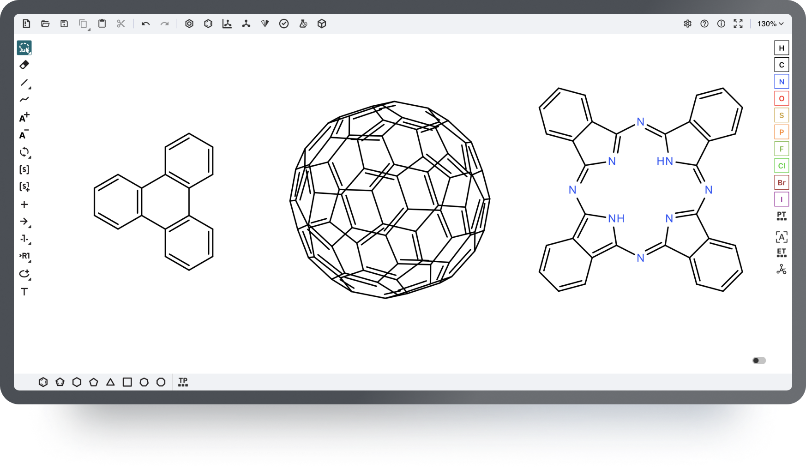

# Ketcher Docker - Chemical Structure Editor Docker Deployment

 [](./LICENSE)


A production-ready Vite-based application that embeds the Ketcher chemical structure editor with full iframe communication support. Demo at [ketcher.mireklzicar.com](ketcher.mireklzicar.com)



## Features

- ⚛️ React 19 + TypeScript + Vite
- 🧪 Ketcher 3.2.0 chemical structure editor
- 🔌 Full iframe communication via postMessage API
- 🏗️ Standalone mode (no backend required)
- 📱 Responsive design
- 🚀 Production-ready build
- 📱 Fixed touch screen keyboard trigger on mobile devices


## 🧾 Attribution & Licensing

This project embeds and redistributes [**Ketcher**](https://lifescience.opensource.epam.com/ketcher/) — an open-source, web-based chemical structure editor developed and maintained by [**EPAM Life Sciences**](https://lifescience.epam.com/).

* **GitHub Repository**: [github.com/epam/ketcher](https://github.com/epam/ketcher)
* **Documentation & Website**: [lifescience.opensource.epam.com/ketcher](https://lifescience.opensource.epam.com/ketcher/)

* **License**: [Apache License 2.0](./LICENSE)
* **Acknowledgments and attributions**: [NOTICE](./NOTICE)


> This project is not affiliated with or endorsed by EPAM Systems. It is an independent deployment and integration of Ketcher (version 3.2.0) with a custom iframe communication layer and self-hosted enhancements.

## Citation

If you use this project in your research or work, please cite both this repository and the original Ketcher project:

### This Repository

```bibtex
@misc{ketcher-docker,
  title        = {Ketcher Docker - Chemical Structure Editor Docker Deployment},
  author       = {Miroslav Lžičař},
  year         = {2025},
  howpublished = {\url{https://github.com/miroslav-lzicar/ketcher-docker}},
  note         = {Accessed: 2025-06-07}
}
```

### Original Ketcher Project

```bibtex
@misc{ketcher,
  title        = {Ketcher: Web-based Chemical Structure Editor},
  author       = {{EPAM Systems}},
  year         = {2025},
  howpublished = {\url{https://github.com/epam/ketcher}},
  note         = {Accessed: 2025-06-07}
}
```

## Quick Start

### Development

```bash
# Install dependencies
pnpm install

# Start development server
pnpm dev
```

The app will be available at `http://localhost:5173`

### Production Build

```bash
# Build for production
pnpm build

# Preview production build
pnpm preview
```

### Docker (Recommended for Production)

```bash
# Build and run with Docker
docker build -t ketcher-docker-app .
docker run -d -p 8080:80 --name ketcher-app ketcher-docker-app

# Access at http://localhost:8080
```

## Iframe Integration

### Basic Usage

```html
<iframe 
  id="ketcher-iframe" 
  src="http://localhost:5173/" 
  width="800" 
  height="600"
  title="Ketcher Chemical Editor">
</iframe>
```

### Communication API

The Ketcher iframe communicates via `postMessage`. All communication is bidirectional and asynchronous.

#### Send Messages to Ketcher

```javascript
const iframe = document.getElementById('ketcher-iframe');

// Set a molecule from SMILES
iframe.contentWindow.postMessage({
  type: 'setMolecule',
  payload: 'CCO'  // SMILES string
}, '*');

// Get current SMILES
iframe.contentWindow.postMessage({
  type: 'getSmiles'
}, '*');

// Clear the editor
iframe.contentWindow.postMessage({
  type: 'clear'
}, '*');
```

#### Listen for Messages from Ketcher

```javascript
window.addEventListener('message', (event) => {
  const { type, payload, smiles } = event.data;
  
  switch (type) {
    case 'init':
      console.log('Ketcher initialized');
      break;
      
    case 'smiles':
      console.log('SMILES received:', payload);
      break;
      
    case 'smiles-update':
      console.log('SMILES updated:', smiles);
      break;
      
    case 'moleculeSet':
      console.log('Molecule set successfully');
      break;
      
    case 'cleared':
      console.log('Editor cleared');
      break;
      
    case 'error':
      console.error('Ketcher error:', event.data.error);
      break;
  }
});
```

## Message Types

### Incoming (to Ketcher)
- `setMolecule` / `set-molecule`: Set molecule from SMILES
- `getSmiles` / `get-smiles`: Request current SMILES
- `clear`: Clear the editor

### Outgoing (from Ketcher)
- `init`: Ketcher initialized and ready
- `smiles`: Response to getSmiles request
- `smiles-update`: Automatic SMILES updates when structure changes
- `moleculeSet`: Confirmation that molecule was set
- `cleared`: Confirmation that editor was cleared
- `error`: Error occurred during operation

## Configuration

### Environment Variables

- `VITE_API_PATH`: Custom API endpoint (fallback for remote mode)
- `PUBLIC_URL`: Base URL for static resources

### CORS Headers

The application is configured to allow iframe embedding from any origin. For production, consider restricting origins in `vite.config.ts`:

```typescript
server: {
  headers: {
    'Access-Control-Allow-Origin': 'https://yourdomain.com',
    // ... other headers
  },
}
```

## Deployment

The application is designed to be deployed as a static site. It includes:

- Standalone Ketcher service (no backend required)
- Optimized production build
- Proper CORS headers for iframe embedding
- Error handling and fallbacks

### Docker Deployment

This project includes a complete Docker setup for production deployment with proper iframe support and CORS configuration.

#### Build and Run

```bash
# Build the Docker image
docker build -t ketcher-docker-app .

# Run the container
docker run -d -p 8080:80 --name ketcher-app ketcher-docker-app

# Access the application
# http://localhost:8080
```

#### Docker Configuration

The Docker setup includes:

- **Multi-stage build**: Uses Node.js Alpine for building and Nginx Alpine for serving
- **Optimized nginx configuration**: Custom [`nginx.conf`](nginx.conf) with SPA routing support
- **Iframe-friendly**: Removes X-Frame-Options to allow cross-origin iframe embedding
- **CORS enabled**: Configured for cross-origin access
- **Asset optimization**: Gzip compression and caching for static files
- **Proper permissions**: Handles file ownership and permissions correctly

#### Key Docker Files

- [`Dockerfile`](Dockerfile) - Multi-stage build configuration
- [`nginx.conf`](nginx.conf) - Production nginx configuration with iframe support
- [`.dockerignore`](dockerignore) - Excludes development files and handles macOS compatibility

#### Production Features

- **Iframe Support**: Full cross-origin iframe embedding capability
- **SPA Routing**: Proper handling of React Router routes
- **Security Headers**: Optimized security headers (except X-Frame-Options for iframe support)
- **Performance**: Gzip compression, asset caching, and optimized delivery

### Vercel Deployment

**🚀 Live Demo**: [https://ketcher-docker-e78uoiplu-miroslav-lzicars-projects.vercel.app](https://ketcher-docker-e78uoiplu-miroslav-lzicars-projects.vercel.app)

The application has been successfully deployed to Vercel with optimized configuration for iframe embedding and CORS support.

#### Deployment Configuration

The project includes a [`vercel.json`](vercel.json) configuration file with:

- **Framework Detection**: Automatically detected as Vite
- **Build Command**: `pnpm build`
- **Output Directory**: `dist`
- **CORS Headers**: Configured for cross-origin iframe embedding
- **SPA Routing**: Proper handling of React Router routes

#### Deploy Your Own

```bash
# Install Vercel CLI (if not already installed)
npm i -g vercel

# Deploy to production
vercel --prod
```

Or deploy the static build directly:

```bash
pnpm build
# Upload dist/ folder to Vercel dashboard
```

### Static Hosting

The built application in `dist/` can be deployed to any static hosting service (Vercel, Netlify, AWS S3, etc.). For iframe embedding, ensure your hosting platform allows:

- Custom headers configuration
- Cross-origin resource sharing (CORS)
- Removal of X-Frame-Options header

## Development

### Project Structure

```
src/
├── App.tsx          # Main Ketcher component with iframe communication
├── utils.ts         # Ketcher service provider setup
├── main.tsx         # Application entry point
├── index.css        # Global styles
├── types
│   └── ketcher-standalone.d.ts # Ketcher type definitions
└── vite-env.d.ts    # Vite type definitions
```

### Key Files

- **App.tsx**: Contains all iframe communication logic and Ketcher initialization
- **utils.ts**: Handles Ketcher standalone service provider setup
- **vite.config.ts**: Build configuration with CORS headers
